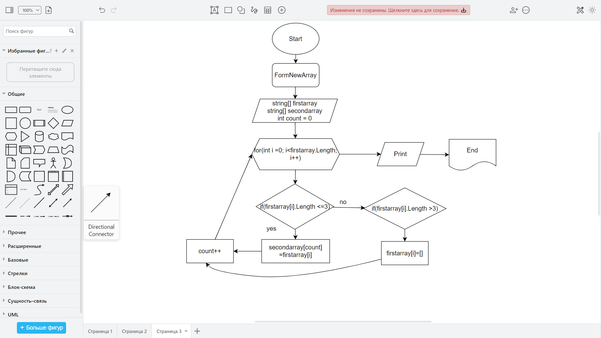

# Oписание решения.
1. Делаем перебор значений из исходного массива с помощью цикла for
2. Проверяем каждое значение из массива на соответствие условию: **`длина строки меньше или равна трем`**
3. Если строка удовлетворяет условию кладем значение в новый массив
4. Если **`длина строки больше трех`** - выводим `[]`
5. Повторяем пункты *`2, 3, 4`* до тех пор пока не достигнем конца исходного массива
6. Возвращаем новый заполненый массив как результат

### *Блок-схема*

